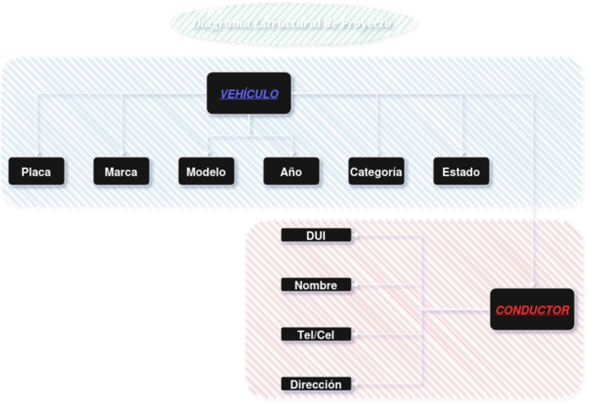

# 🚗 True Drive - Proyecto Final de Programación de Algoritmos

**Lenguaje:** C++  
**Modalidad:** Consola (Aplicación de escritorio)  
**Institución:** Universidad Don Bosco — 2025  

---

📌 **Descripción del Proyecto:**  
Aplicación de escritorio en consola para la **gestión de una empresa de transporte privado**.  
El sistema permite:

- Registro de vehículos y conductores
- Asignación eficiente de vehículos
- Almacenamiento persistente de datos
- Generación de reportes
- Aplicación de principios de **programación estructurada** y **orientada a objetos**

---

## 🧩 Diagrama estructural del proyecto

---

✍️ Desarrollado como parte del proyecto final de la materia **Programación de Algoritmos**.
